# LatihanVCS

**Repository ini dibuat untuk memenuhi tugas Bahasa Pemrograman**  

**Nama : Riris Naomi Gurning**  

**Nim : 312010190**  

**Kelas : TI.20.A.1**  

## Langkah - Langkah Penggunaan git

* Download git terlebih dahulu dengan link berikut [click here](https://git-scm.com)  

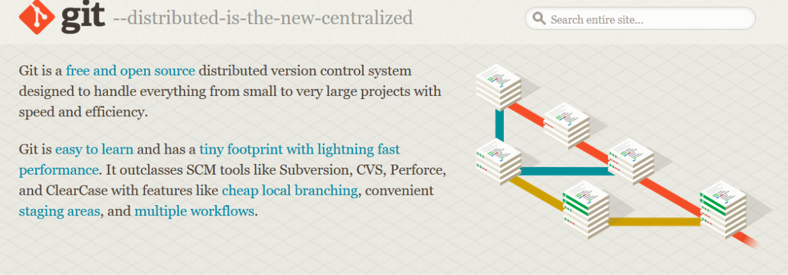  

* Setelah instalasi selesai, buka *software* **Gitbash** pada menu di windows, dan lakukan pengecekan **versi**, dengan mengetik *syntax* berikut :  

`git --version`  

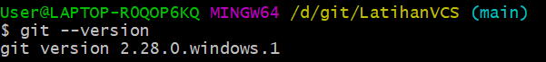  

* Jika muncul tampilan **git version**, berarti Git sudah **Berhasil di install** dan bisa di **gunakan** Langkah pertama kita harus **mengkorfirmasikan user name dan email di git**, dengan mengetikkan *syntax* berikut :  

`git commit --global user.name "masukan nama anda"`  

`git commit --global user.email "masukan email anda"`  

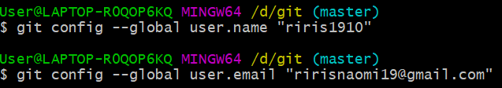  

* Setelah diisi, silahkan lakukan pengecekan user nama dan email, dengan mengetikkan perintah berikut :  

`git config --global user.name`  

`git config --global user.email`  

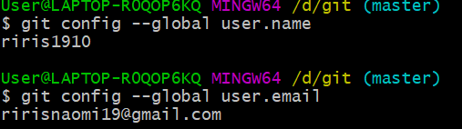  

* Buat akun di **GitHub**,seperti contoh dibawah ini. Dan lakukan Verifikasi akun melalui email yang sudah terdaftar.  

* Jika akun **GitHub** sudah selesai dibuat dan di verifikasi,proses selanjutnya silahkan buat Repository seperti gambar dibawah ini: **Penjelasan**  

> *`Repository Name : (Silahkan isi nama repository yang diinginkan, seperti contoh saya ingin membuat repository LatihanVCS)`*  

>*`Description : (Isi dengan deskripsi atau penjelasan tentang repository Anda)`*  

>*`Public / Private : (PIlih salah satu jenis repository akan bisa dilihan sama semua orang atau tidak)`*  

>*`Add a README.md file : Centang pada bagian ini jika Anda menginginkan file README.md ada di repository Anda`*  

>*`Add .gitignore : Merupakan sebuah file yang berisi daftar nama-nama file dan direktori yang akan diabaikan oleh Git.`*  

>*`Choose a license : Silahkan centang jika Anda memiliki lisensi pada repository yang akan dibuat Kemudian tekan tombol Create Repository untuk menyimpan`*  

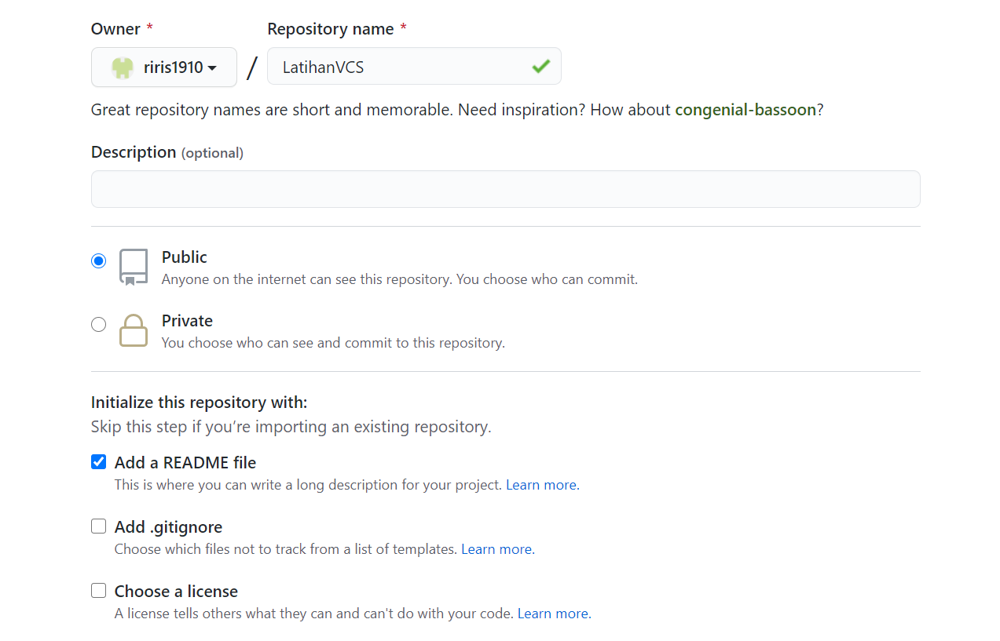  

* Jika repository sudah dibuat maka akan muncul tampilan seperti dibawah ini :  

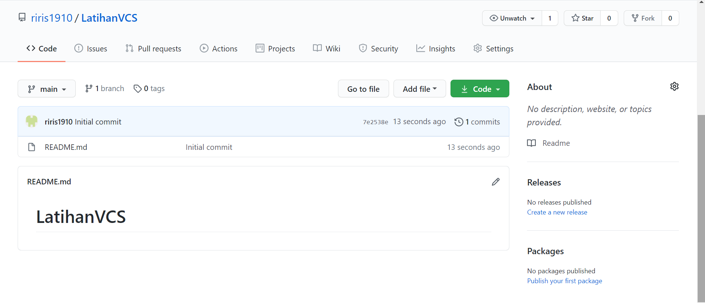  

* Pembuatan akun dan repository pada Github telah selesai, saat ini akan kita lakukan untuk *me-remote* repository Github pada GitBash Lokal. Bagaimana caranya? Langkah pertama kita harus menyalin link *URL git* kita di Github, dengan cara tekan tombol **Code** lalu klik *Copy*.

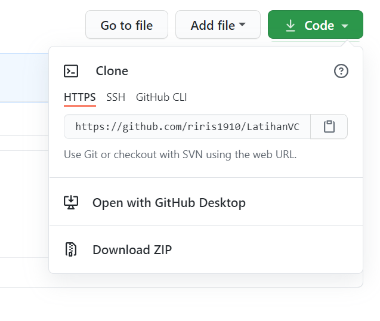  

* Setelah *Link URL* git kita *tercopy*, Silahkan buka File Explorer pada Windows, kemudian pilih folder dimana kita akan *mendownload* Repository dari Github ke lokal. Kemudian Klik Kanan, Pilih **Git Bash Here**.  

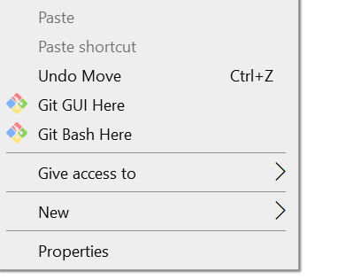  

* *Pop Up* Command Prompt **(CMD)** akan terbuka. Pada proses ini kita akan melakukan download file repository yang tadi dibuat, dengan mengetikkan *syntax* berikut :  

`git clone [URL] pada contohnya, saya akan memasukan git clone`  
https://github.com/riris1910/LatihanVCS.git  

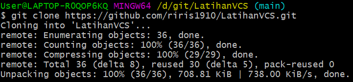  

* Setelah proses cloning selesai, pada saat ini kita masih pada folder awal (master), kita harus masuk kedalam folder yang telah dicloning tadi yaitu *LatihanVCS* dengan mengetikkan *syntax* berikut :  

`cd LatihanVCS/`  

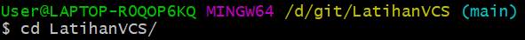  

* Saat ini kita sudah masuk kedalam folder *LatihanVCS*, Silahkan edit file README.md yang ada di File Explorer. Bisa menggunakan Text Editor *(Sublime Text, Notepad, Notepad++, Visual Studio Code)*. Edit sesuai dengan keinginan. Aturan file .md (Markdown) bisa dilihat di Link berikut ini : [click here](https://guides.github.com/features/mastering-markdown/)  

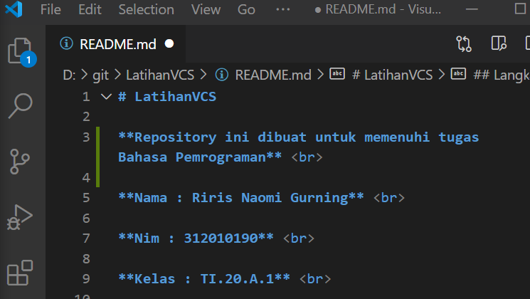  
